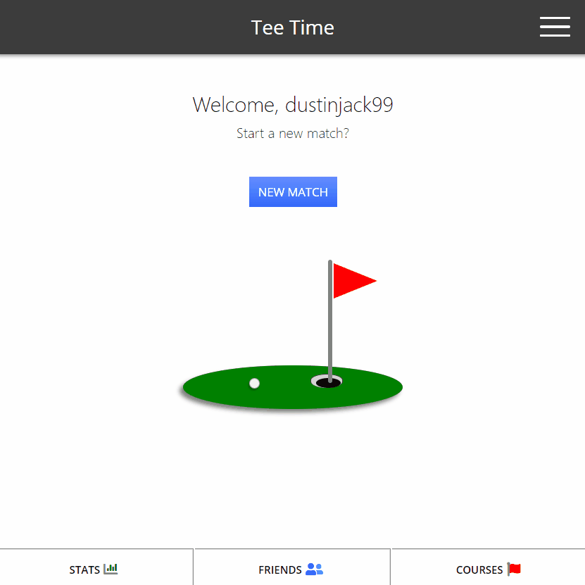
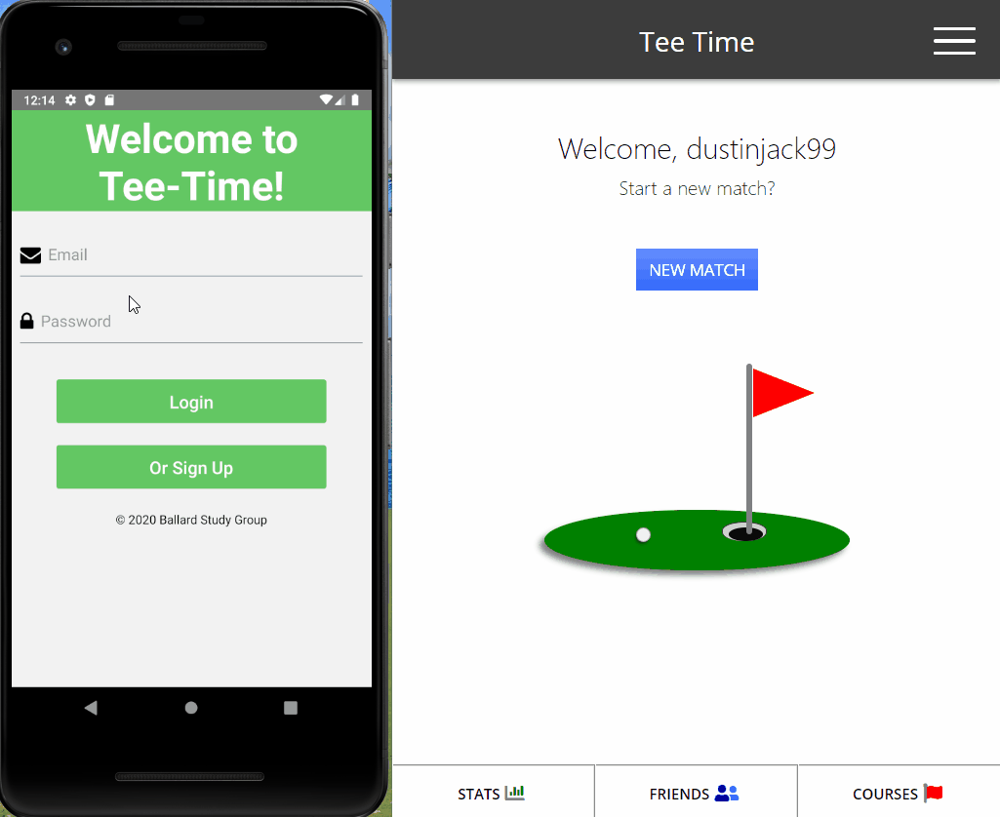

# Tee-Time

## Live Demos

<h3 align="center">Tee Time in Browser</h3>

<h3 align="center">Tee Time on Mobile w/ React Native</h3>

## The Assignment
This app was the second project for UW Full-Stack Bootcamp. The requirements were to make an application with a friendly client-side UI utilizing the MERN stack framework (Mongo DB, Express, React, and Node). 

The technologies we utilized were: the MERN framework, mongoose, Sass CSS compiler, Recharts, Sweet Alert, BCrypt Hash, axios, socket.io for our chat room, and the Golf Genius software API. 

## The Team
This project if brought to you by:

- Austen Turner (austenpturner)
- Dustin Jackson (dustinjack99)
- Eric Bossler (e-bossler)
- Jon Lee (enadan)

## The Process
<!-- We started the project using some starter code given to us. The started code included Passport and Sequelize ORM. Passport is used to authenticate our users and save their passwords safely using bcrpyt and hashing. The started code used jQuery to route to a login and signup page, however since we prefer using vanilla JavaScipt we re-wrote all the jQuery get and post requests in regular JS. 

Using MySQL we made a database and two tables, one for Users and one for Ducks. The User's model was already in the starter code, so all we needed to do was add a Ducks model and create datatypes and validation for the column values. Once we were able to register and save user's to the user model and our database, we added a ducklist and playground page so we could begin adding our ducks. Users can have multiple ducks, but ducks can only belong to one user so we used a duckId value to join the two tables. With the models joined, users were able to access their saved ducks on the ducklist page when they login, or make a new ducks. We used handlebars for the ducklist and playground pages to render the user's ducks.

The get and post routes for the app were the most difficult part of the project. We split our routes up into html-routes, api-routes and duck-routes. The duck-routes are used to update the Duck model when the user interacts with the duck in the playground. Each time a user clicks a button on the game controllers to ineract with their duck a post request is made, sending updated information to the database and saving a new value for the duck.

The duck is made of pure CSS and is animated using animate.css. We decided to use Sass for writting and organizing our styles. This was helpful to break up the page styles into multiple files and save colors for re-use.

When the user interacts with the duck, the duck gets hungry! However, the user only starts with a certain amount of duckbucks and duckfood. When the user is out of food and bucks they are redirected to a duckbucks page where they can choose to buy more duckbucks using PayPal. This takes the user to a PayPal sandbox where they can purchase duckbucks. After their purchase, they are taken back to the playground where they can continue to play with their duck. -->

## Future Development
We are very proud of our MVP, however we believe there are a few features that could be added to create an awesome user experience. For example, we would love to have a real time GPS tracking of golfers on individual courses and holes. This could be used to see where your partners are on the course, or if other users are also playing the same course. 

Utilizing a google-maps-like API we believe we this could be accomplished, however due to schedule constraints this was unable to be implemented.

Also, a user store for golf related items would be a good addition to this applciation for monetization purposes. We could also include a section of the application called the 'clubhouse' or some other general term for user interactions outside of a golf match. 

## Thanks for reading! :smile:
Please contact the team with any questions or comments.
